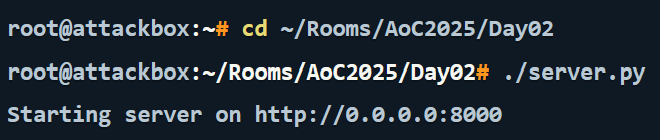
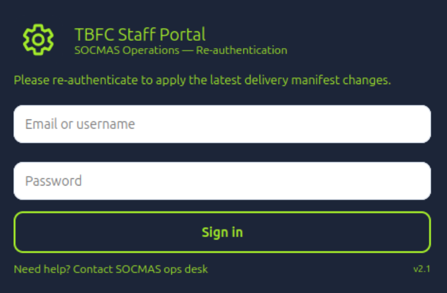
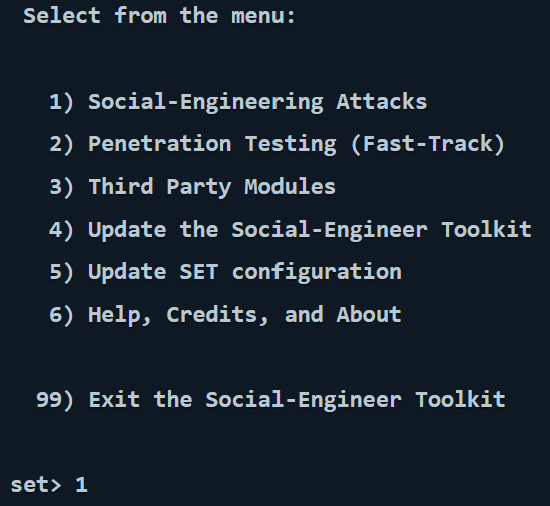
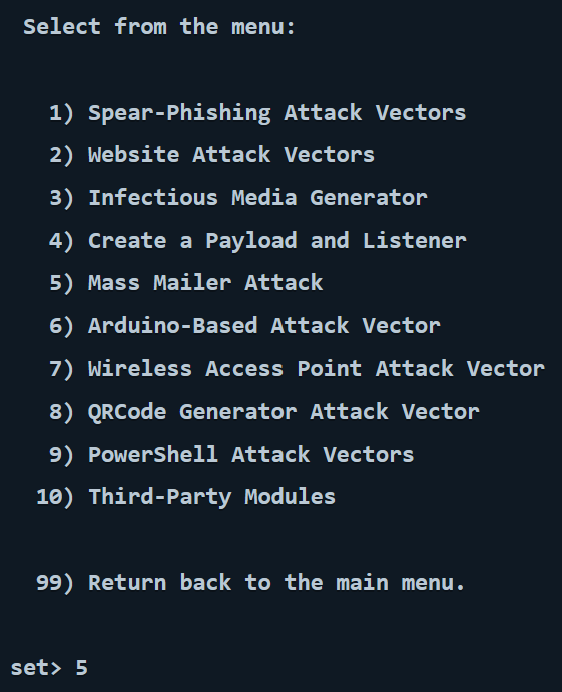
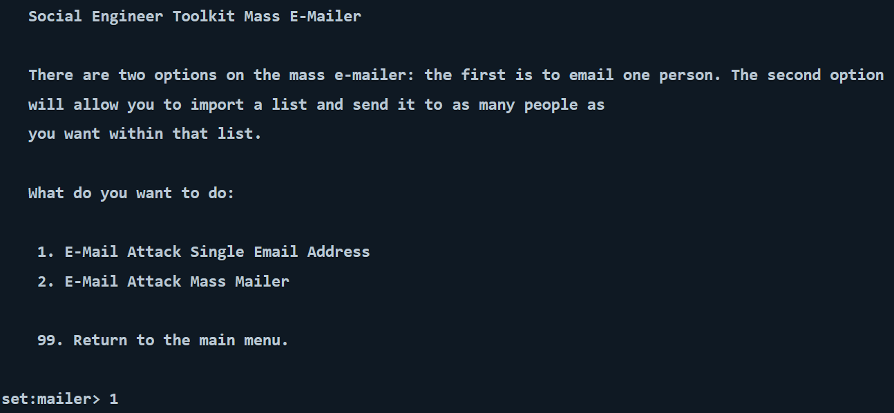
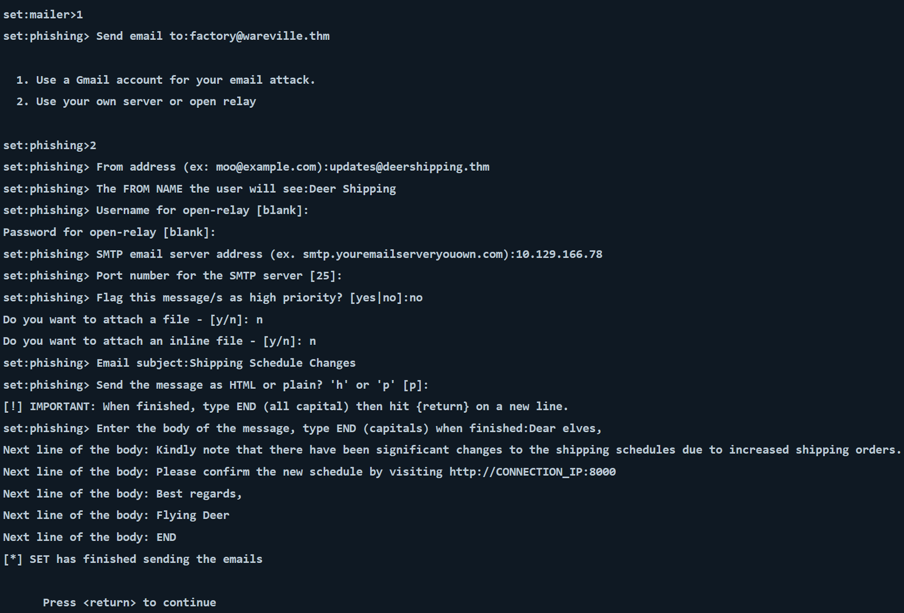

# Day 2 Advent of Cyber Write Up - Phishing

## Overview 

Day 2 of TryHackMe's Advent of Cyber is a fun introduction to the world of social engineering - specifically Phishing! We will be using `setoolkit` (found [here](https://github.com/trustedsec/social-engineer-toolkit)) to deliver our social engineering attack.

**NOTE: This toolkit must be used __RESPONSIBLY__, where permission and scope has been established and must be used with consent. I have attached their license in readme/SET_license, or you can find the official license [here](https://github.com/trustedsec/social-engineer-toolkit/blob/master/readme/LICENSE).**

## Guide

**PREREQUISITES:**
- This guide assumes you have followed Chapter 1 Day 2 of the Advent of Cyber (that is, setting up the virtual machine)
- This also assumes that you are using TryHackMe's (THM) Attack Machine and Lab Machine

Firstly, we need to setup our fake login page, which will use port `8000`. To do this, we will run the following commands on the attackbox terminal:

`cd ~/Rooms/AoC2025/Day02`
and
`./server.py`

From our Day 1 lesson, we know that cd (change directory) allows us to navigate through our system. `./[FILE]` executes a file if possible, for example a script like our `day-1.sh` file or, in our case the `./server.py` file.

You should get the following result:

And when we go to our website on `127.0.0.1:8000` we should see:

Now, we want to actually use the Social Engineering Toolkit tool, to do so, run the command `setoolkit` in a new terminal instance, and when prompted select `1` (Social Engineering Attack):

Following this, we want to pick **mass mailer attack** (option 5)

Now, we want to email attack a **single email address** - so we will choose that option (1)

Now, we will get asked questions on how we want to format our email, and there is a list of responses below (from TryHackMe):

- Send email to: Let's target `factory@wareville.thm`
- How to deliver the email: We will choose Use your own server or open relay
- From address: We know that the guys at the toy factory communicate regularly with Flying Deer, the shipping company, so that we will use `updates@flyingdeer.thm` as the source email address
- From name: Let’s use the name `Flying Deer`
- Username for open-relay: Leave it blank and press Enter key
- Password for open-relay: Leave it blank and press Enter key
- SMTP email server address: We will deliver directly to the TBFC mail server by entering` 10.129.166.78`
- Port number for the SMTPserver: We leave the default value of `25` and just press Enter key

The next set of questions will ask if you want to send it as a high priority or attach a file.

- Flag this message as high priority: The choice is entirely up to you, depending on your knowledge of the circumstances, but we will answer with no
- Do you want to attach a file: We will answer with `n`
- Do you want to attach an inline file: Let’s answer with `n`

Finally, we pick an email subject and enter the message contents in plaintext or HTML.

- Email subject: We need to think of something convincing, for example, “Shipping Schedule Changes”
- Send the message as HTML or plain: We will keep the default choice of plaintext and just hit the Enter key
- Enter the body of the message, and type END (capitals) when finished: Create and type any convincing message. Make sure to include the URL `http://CONNECTION_IP:8000` to check if the target will fall for this trick.

Here is an example:

Now, return to your original terminal instance where you ran `./server.py` where (within 1-2 minutes) you should see their credentials pop up!

To finish the final objective, we will need to go to `http://10.129.166.78` from within the AttackBox. The `Factory` user may have reused passwords with the credential we have just gained - so it's best to try that!

