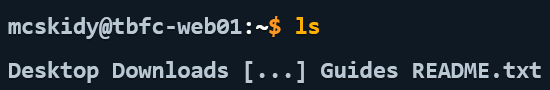

# Day 1 Advent of Cyber Write- - Linux CLI

## Overview 

Day 1 of TryHackMe's Advent of Cyber was a basic introduction to Linux via CLI and using grep to search files. ||Using these commands, you will search through the Linux filesystem to find traces left behind by Sir Carrotbane||

List of commands used:
`echo [INPUT]` prints a given input to the terminal, good for debugging programs. 
`ls [OPTION]` lists all the files in the curret directory
- For more details about [OPTION] you can read the man7 page for ls [https://man7.org/linux/man-pages/man1/ls.1.html](here)
`cat [FILE]` outputs the contents of a file
`cd [PATH]` changes your current directory to a directory of your choosing
`grep "[SEARCHTERM]" [FILE]` Searches the given file for the searchterm, and returns any results found
`find [DIRECTORY] -name [NAME]` Searches the directory for the given name and returns any files found

## Guide

**PREREQUISITES:**
- This guide assumes you have followed Chapter 1 Day 1 of the Advent of Cyber (that is, setting up the virtual machine)

First and foremost, we need to find out where we are in relation to the system. To do this we simply need to run `ls`

Now it seems we have found an important file.. so let's run `cat` on `README.txt` and see what it says:

It appears that we have to follow the trail left behind by McSkidy.. Since there is a `Guides` directory, we might as well check. Run `cd  Guides` to navigate the directory, then run `ls`.

Oh? There's nothing there.. On the surface that is. We can see if McSkidy has left any hidden files by adding some _parameters_ to the `ls` command. Instead, try running `ls -al` and you should get the following output:

Now we have found the _dotfile_ that McSkidy left behind! Dotfiles, as their name suggests, has a dot at the start of their name. This keeps them hidden from regular ls searches, and are good for hiding information/directories from the average user.

Now, let's `cat` into this file and see what we can find:

Looks like we have to make our way to `/var/log` and look for any failed password attempts! We can do this by using `grep "Failed Password" auth.log"` 

So now we know that there was multiple failed login attempts, a strong indicator of an attack.

Let's look for any suspicious files left on the system by using `find /home/socmas -name *egg*`

Looks like we found a sh file. These files are bash files that contain scripts that will run when executed, similar to an executable on Windows. We can run `cat` on it to view the contents and the script.

We can now dissect this script to understand how it works.

`#` Are commented lines in files, useful for documentation and understanding what code does later
`cat wishlist.txt | sort | uniq` Outputs the contents of `wishlist.txt`, sends the output to be sorted, and then sorts it by unique elements
- `|` is called a pipe, it takes an output from the first command and sends it to the second command
`> /tmp/dump.txt` Takes any output from the first command and overwrites a file called dump.txt with the output
`rm wishlist.txt && echo "Chistmas is fading..."` Deletes wishlist.txt (`rm`) and prints "Christmas is fading..." to the terminal
`mv eastmas.txt wishlist.txt && echo "EASTMAS is invading!"` Replaces the `wishlist.txt` with `eastmas.txt` (`mv`) and prints "EASTMAS is invading!" to the terminal.

Every command that is run is saved in a history file called `.bash_history`. It can be found in /home/[USER]/.bash_history or /root/.bash_history.

To complete the final objective, we must enter `root` (or Superuser, the same as an administrator), by running `sudo su`

We can shorten two commands into one. Instead of running `cd /root` and `cat .bash_history` seperately, we can run one single command `cd /root && cat .bash_history` where can find the flag that Sir Carrotbane has left!

