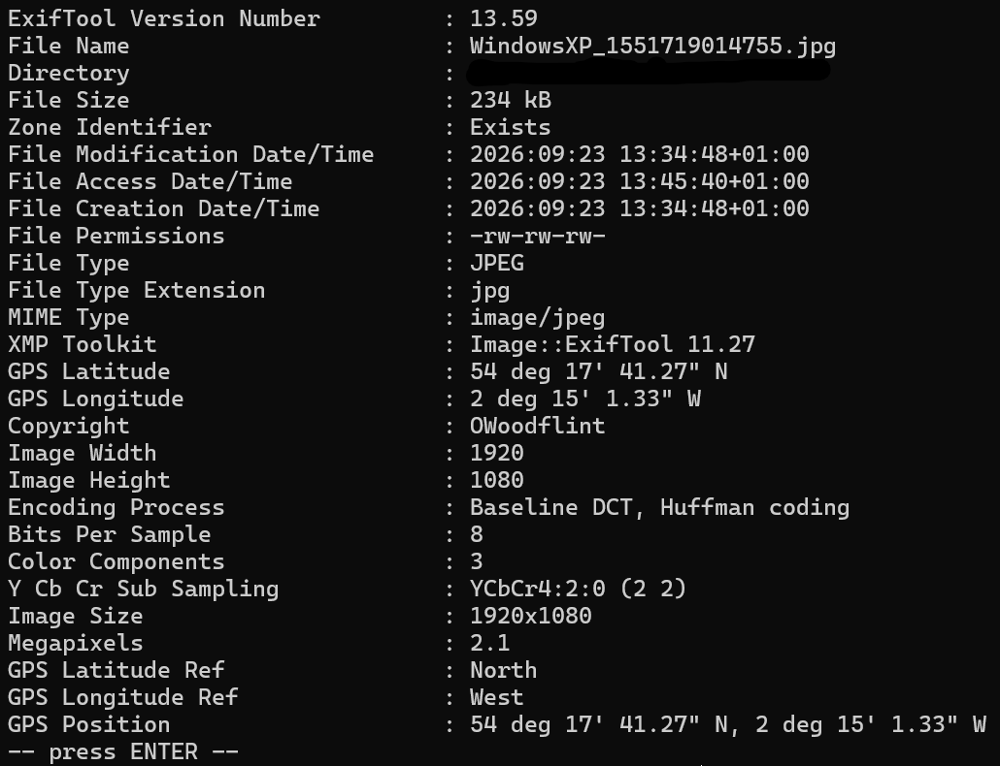
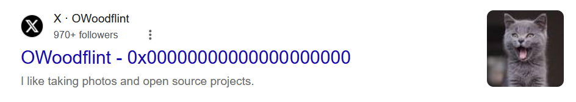
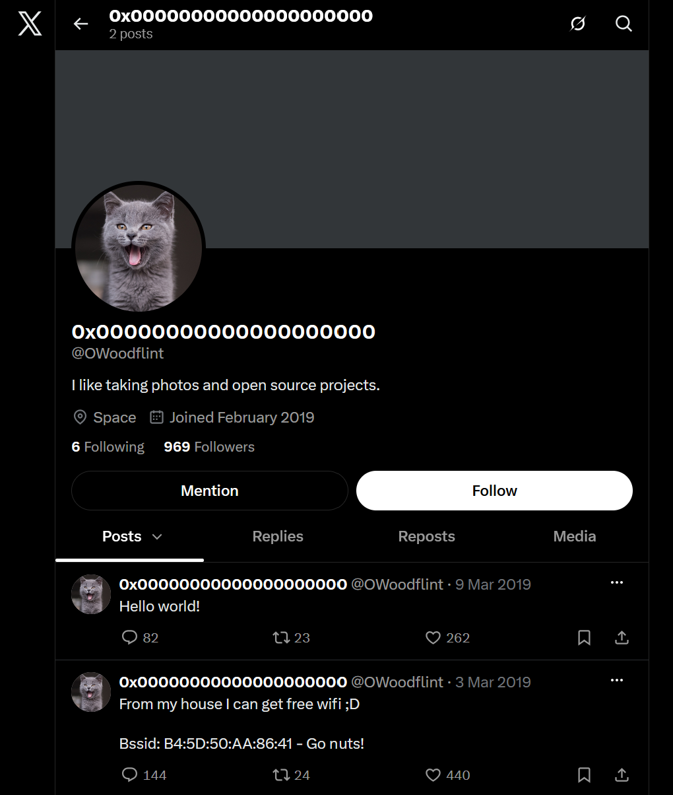
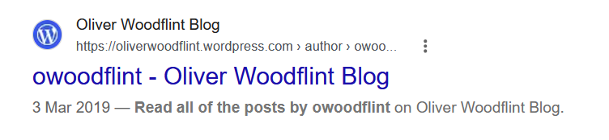
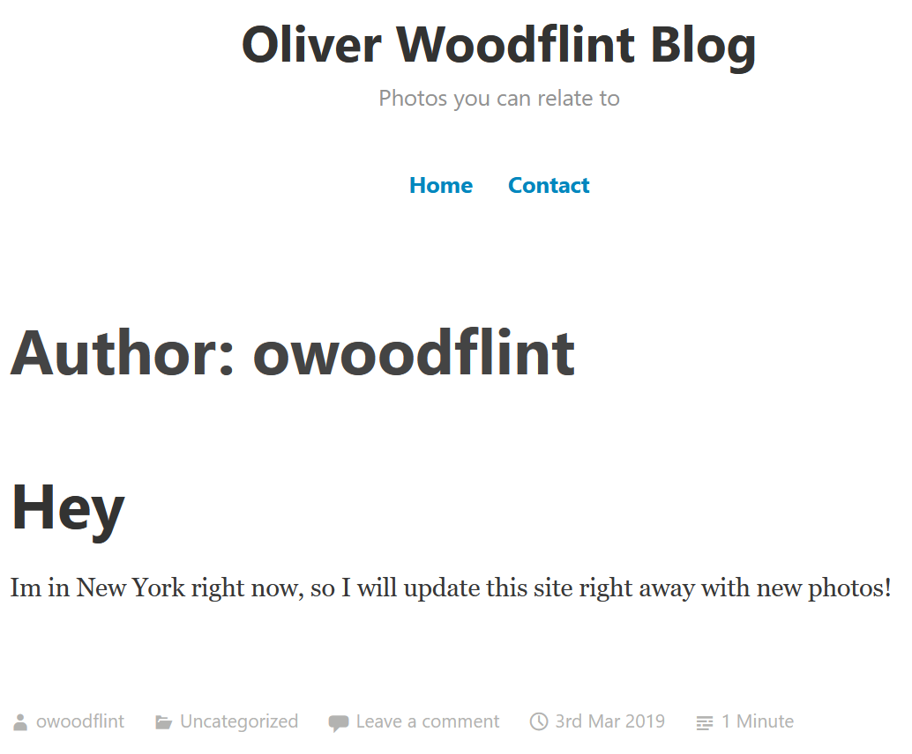

# OhSINT TryHackMe Room Write Up 

## Overview
This is a write-up for the OhSINT TryHackMe Room - although I had previously completed this around November 2025, I had not documented it.
As it has been almost a year since completing the room. I will attempt to complete it again and document my steps thoroughly.

This small write up will contain:
- A record of my steps & My thought process
- Conclusion
Note: If you just want to follow my steps, you can skip the Main Thoughts Section and find the Steps Section

## Thoughts, Steps & Thought Process
With the file provided, I know it is always best to start with the metadata that could be left behind, I will use `exiftool` to find the metadata of the file:

    

In the "copyright" section specifically we see the name "OWoodflint". Aliases online are frequently the same on other platforms, so we can use this to our advantage and search for it.
- Ignoring the AI Overview, we get the following results of interest:

    Their Twitter pages:
     
    
     
    
     
     
    Their Wordpress blog:
     
    
     
    

It is quite scary how much information you can get from 1 image, and from just finding their alias - we can answer questions 1 and 6 as we know:
- Their avatar
- Where they are on holiday to

A further scroll down reveals their GitHub too:

    Their Github Page:
     
    
     
    

And now we can answer questions 4 and 5 from their Github because it contains:
- Their Email Address
- Where we found it (Github)

On their Twitter, they also posted their BSSID - we can use a service like [WiGLE](https://wigle.net/) to find the SSID of the network they are connected to.
Doing a search on WiGLE shows us their SSID and Location, allowing us to answer questions 2 and 3.